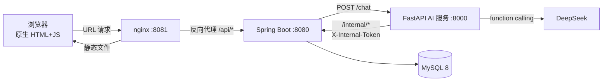

# 电商订单智能客服平台

基于大模型 function calling 的智能客服系统：AI 能自主查询订单、判断退货资格、创建售后工单，
遇到超出能力边界的请求自动转人工审核。

**Java 业务服务 + Python AI 服务双服务架构 · 18 个接口全部实现**

## 项目背景

电商客服每天要处理大量重复问题："我的快递到哪了""这个还能退吗""我上次的申请怎么样了"。
这些问题规则明确、答案固定，却占用了客服大部分时间。

本项目让 AI 接手这部分确定性工作，同时**明确划出它的能力边界** ——
超期退货、用户表述含糊、AI 自己拿不准的时候，自动转人工，而不是让 AI 硬答。

## 技术架构



**为什么拆成两个服务**：

- **Python 不碰 MySQL** —— 所有业务数据只由 Java 读写，AI 服务要数据只能带 token 调 `/internal/*`。
  好处：即使提示词被注入，AI 也碰不到数据库；AI 的每个数据动作都经过 Java，天然留下审计记录。
- **扩容策略不同** —— AI 服务是 IO 密集（一直在等大模型响应），Java 是事务密集，
  两者应该用完全不同的扩容方式，捆在一个进程里只能一起扩。
- **数据所有权清晰** —— 业务规则的唯一来源是 Java，AI 层不复制规则。

### 一次退货请求发生了什么

```
用户说"我要退那个口红"
  → Python：判断意图，决定调 search_user_orders 找到订单和商品
  → Python：调 check_refund_eligible（Java 判断"签收后 7 天"这条规则）
  → 若已超期：Java 返回 suggestManualReview=true
  → Python：不硬拒，而是调 create_after_sale 建一张 MANUAL_REVIEW 工单
  → 回复用户"已为您提交人工审核，客服会在 24 小时内联系您"
```

整条链路里，**"超过 7 天"这个判断只发生在一处（Java）**，
AI 负责理解用户说了什么、决定调哪个工具、把结果组织成人话。

## 技术亮点

### 1. AI 有 5 个工具，自己决定调哪个

用**原生 function calling**，没有用 LangChain：

| 工具 | 用途 | 有无副作用 |
|---|---|---|
| `query_order` | 按订单号查详情（含物流） | 只读 |
| `search_user_orders` | 按状态 / 商品名搜订单 | 只读 |
| `search_after_sale` | 查历史售后工单 | 只读 |
| `check_refund_eligible` | 查退货资格 | 只读 |
| `create_after_sale` | **创建售后工单** | **写操作** |

**为什么不用 LangChain**：本项目只有 5 个工具、单轮编排，LangChain 会引入 87 个依赖、
每次调用多约 200ms 抽象开销，收益为负。抽象层的成本要小于它省下的代码量才值得引入。

**工具描述里必须写清分工边界**，否则模型会混用。比如 `check_refund_eligible` 的描述里
明确写了"这是只读操作，真正建工单要用 create_after_sale" ——
不写清楚，模型可能在用户只是随口问问的时候就真去建单了。

### 2. 人机协同：AI 干 80%，人干 20%

AI 最危险的不是答错，是**自以为答对了**。所以系统里有两道自动转人工的闸门：

- **置信度闸门**：AI 建工单时给自己打的分 `< 0.7` → 工单直接进 `MANUAL_REVIEW` 状态
- **超期兜底**：商品超出 7 天无理由退货期时，接口返回 `eligible=false` 但 `suggestManualReview=true`
  —— AI 不会硬邦邦回一句"不行"，而是转成人工审核

这个设计同时说明四件事：理解 AI 的能力边界、有风控意识、懂人机协同、会设计兜底。

### 3. 权限边界不交给模型

工具里的 `userId` 是**用闭包锁死的**，模型能决定的只有"查什么"，永远不能决定"查谁的"：

```python
def build_query_order(user_id: int):
    def query_order(order_no: str) -> dict:
        # userId 来自 Java 从 JWT 解析后注入，不是模型能给的参数
        params = {"userId": user_id}
        ...
    return query_order
```

否则模型（或通过提示词注入的攻击者）可以伪造 `userId` 去查别人的订单。

**同一个原则在 Java 侧**：内部接口要求 `X-Internal-Token`，
且 nginx 配置里 `location /internal/ { deny all; }` —— 公网访问不到。

### 4. 业务规则的唯一来源

"签收后 7 天可退"这条规则只在 Java 侧实现一次，AI 调 `check_refund_eligible` 拿结论，
自己不做任何期限计算。

**为什么**：两边各算一遍，迟早算出不同结果，而且出问题排查时不知道该信谁。
同一条规则有两处实现，就是两处 bug 的来源。

### 5. 幂等设计

AI 多轮对话里，用户很可能连说两遍"我要退货"。`create_after_sale` 按
`orderNo + productId + type` 做幂等 —— 已存在活跃工单时直接返回原工单号，不会建出两张单。

### 6. 降级不降级体验

大模型服务挂掉是常态。AI 服务不可用时返回 `intent=FALLBACK` 的兜底话术，
用户看到的是"客服暂时忙不过来"，而不是一个 500 错误页。

## 快速开始

### 环境要求

| 依赖 | 版本 |
|---|---|
| JDK | 21 |
| Maven | 3.9+ |
| MySQL | 8.0 |
| Python | 3.10+ |
| nginx | 任意稳定版（仅部署形态需要） |

### 1. 初始化数据库

`sql/schema.sql` 里已经包含建库语句，直接导入即可：

```bash
mysql -u root -p --default-character-set=utf8mb4 < sql/schema.sql
mysql -u root -p --default-character-set=utf8mb4 < sql/seed_data.sql
```

建出来的是 `commerce_service` 库，14 张表 + 示例数据（200 个用户、200 个商品、订单与工单）。

### 2. 配置 Java 服务

```bash
cp src/main/resources/application.properties.example src/main/resources/application.properties
```

然后填里面三项自己的值：数据库用户名/密码、`jwt.secret`（随便一串随机字符）、
`internal.token`（自己编一串，要和下一步 Python 那边保持一致）。

### 3. 配置 AI 服务

```bash
cd ai-service
cp .env.example .env
python -m venv .venv
.venv/Scripts/pip install -r requirements.txt      # Windows
# source .venv/bin/activate && pip install -r requirements.txt    # macOS / Linux
```

`.env` 里填 `DEEPSEEK_API_KEY`；
`INTERNAL_TOKEN` **必须和上一步 Java 的 `internal.token` 完全一致**，否则 AI 调不通内部接口。

### 4. 启动三个服务

```bash
# 终端 1：Java 业务服务
./mvnw.cmd spring-boot:run

# 终端 2：Python AI 服务
cd ai-service && .venv/Scripts/python -m uvicorn main:app --port 8000

# 终端 3：nginx（同时提供前端静态文件和 /api 反向代理）
nginx
```

浏览器打开 `http://localhost:8081`。

> **本地环境备注（仅 Windows 开发机）**
> 本机 80 和 8080 端口被其他程序占用，所以 nginx 监听 8081、Java 需要显式指定端口：
>
> ```bash
> ./mvnw.cmd spring-boot:run "-Dspring-boot.run.arguments=--server.port=18100"
> ```
>
> 此时 nginx 配置里的 `proxy_pass` 要相应改成 `http://127.0.0.1:18100`。
> 正常环境用默认的 8080 即可。

### 测试账号

| 用户名 | 密码 | 角色 | 能做什么 |
|---|---|---|---|
| `user0001` | `123456` | 普通用户 | 查自己的订单、申请售后、和 AI 对话 |
| `user0108` | `123456` | 客服 | 看到全部工单、做状态流转 |
| `user0092` | `123456` | 管理员 | 同客服 |

同一张工单用三个账号分别登录，看到的内容不一样 —— 权限是在 Service 层用 `UserContext` 判的。

## 接口文档

完整契约（请求/响应示例、错误码、工单状态机流转表）见 **[`docs/API.md`](docs/API.md)**。

共 18 个接口：

- **外部 13 个**：认证 2 / 订单 3 / 售后工单 4 / 对话 4，前端已全部接入
- **内部 5 个**：`/internal/*`，仅供 Python AI 服务调用（不包 `Result`、
  要求 `X-Internal-Token`，并在 nginx 层禁止公网访问）

## 目录结构

```
├── src/main/java/com/mayiran/commerceservice/
│   ├── controller/      # 7 个 Controller（含 2 个内部接口）
│   ├── service/         # 业务逻辑；状态机校验与越权判断都在这一层
│   ├── mapper/          # MyBatis 数据访问
│   ├── enums/           # OrderStatus / AfterSaleStatus / EligibilityCode
│   └── ...
├── src/main/resources/
│   ├── mapper/          # MyBatis XML
│   └── application.properties.example
├── ai-service/          # Python AI 服务
│   └── main.py          # SYSTEM_PROMPT + 5 个工具 + 两轮 function calling 编排
├── frontend/            # 原生 HTML + JS，零依赖零构建
│   ├── login.html / orders.html / tickets.html / chat.html
│   ├── assets/          # ui.js 公共组件、api.js 请求封装
│   └── nginx.conf.example
├── sql/                 # schema.sql 建表 + seed_data.sql 示例数据
└── docs/API.md          # 接口契约
```

## 演示

<!-- 部署后在这里补一张截图或 30 秒 GIF：用户问退货 → AI 自动查资格 → 建单 → 转人工。
     README 里有没有演示，可信度差很多。图片放 docs/images/ 下，然后写成：
      -->

待补充演示截图。

## 已知限制

- **单轮工具编排**：目前只做"模型决定调工具 → 执行 → 组织回答"这一轮，不做多步链式调用
- **无多轮记忆**：每次请求不携带历史消息，用户说"就那个订单"时 AI 无法指代上下文
- **未接入 RAG**：政策类问答（如"七天无理由怎么算"）目前依赖模型自身知识，没有接知识库
- **置信度是启发式信号**：`ai_confidence` 是模型的自评分而非校准过的概率，
  只用 0.7 阈值做粗粒度分流
- **内部接口的异常返回体不统一**：`/internal/*` 抛异常时会被全局异常处理器包成
  `Result` 结构，与"内部接口用 HTTP 状态码表达错误"的设计目标不一致，待重构
- **对话记录的 `confidence` 字段是占位值**：`t_chat_message.confidence` 目前写入固定值，
  真正的模型置信度只存在于建单场景（`t_after_sale.ai_confidence`）

## 后续规划

- [ ] 多轮对话记忆（会话级上下文）
- [ ] 政策知识库 RAG
- [ ] 离线评估：用标注好的问答集跑批，量化对比提示词与工具描述迭代前后的效果

---

个人学习项目。
